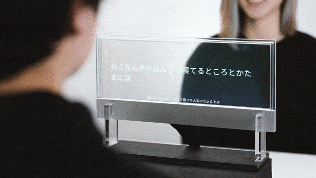

# See-Through Captions

透明ディスプレイを採用することで，誤認識による伝達ミスを防ぎ，表情や身振り手振りなどのボディーランゲージを見ながら利用できるリアルタイム文字起こしシステム。

プロジェクトページ: https://digitalnature.slis.tsukuba.ac.jp/2021/02/see-through-captions/

# デモページ
https://digitalnaturegroup.github.io/see-through-captions/  
*PC版のGoogle Chromeでアクセスしてください。

**目次**
- [動作環境](#動作環境)
- [何ができるか](#何ができるか)
- [翻訳機能について](#翻訳機能について)
- [開発者の方へ](#開発者の方へ)
- [よくある質問](#よくある質問)
  - [使用環境関係](#使用環境関係)
  - [機能について](#機能について)
- [外部のライブラリ（サブモジュール）について](#外部のライブラリサブモジュールについて)
- [関連資料](#関連資料)
- [参考資料](#参考資料)

# 動作環境
同様の環境で動かない場合はブラウザのアップデートや別ブラウザでの利用等をお試しください。
- PC版 Google Chrome
  - Windows, macOS で動作確認済み

# 何ができるか
- 音声からリアルタイムで文字起こしを行い，反転した文字と共にブラウザ上で表示する
  - 音声操作
  - 表示する文章のひらがな化
  - 表示する文章にふりがな付与
  - 文字自動消去秒数変更
  - 表示する文章の翻訳
  - 認識する言語の変更
  - 翻訳する言語の変更
- 表示する文字のスタイルの調整
  - 調整した設定はブラウザに自動保存（[設定項目はこちら](docs/list_saved_setting.md)）

# 翻訳機能について
本システムで翻訳機能を使用するためには，各自で Google App Script(GAS) を用いた翻訳APIを用意していただく必要があります（[→ GASによる翻訳API用意の仕方](docs/howto_translation_setting.md)）。

用意していただいたAPIをサイトアクセス時にクエリパラメータ（`translate_api`）として渡すか，サイト内の「詳細設定」内に設置されている入力フォームから送信することで，翻訳機能が有効化され翻訳のためのUIが現れます。

# 開発者の方へ
[こちら](CONTRIBUTING.md)のルールに則って開発をお願いします。

# よくある質問
## 使用環境関係
### Google Chrome って何？どうやって使うの？
- Google Chrome は Google が提供しているウェブブラウザ（ウェブページを表示するためのソフトウェア）です。
- 下記ページからダウンロード・インストールすることで利用できます。  
Google Chrome ダウンロードページ: https://www.google.com/chrome/

### マイクが認識されない
- ページを再読み込みするか，ブラウザの設定を確認してください。  
参考: https://support.google.com/chrome/answer/2693767?co=GENIE.Platform%3DDesktop&hl=ja&oco=1

## 機能について
### 文字の修正をしたい
- 音声認識結果の修正はできませんが，透明ディスプレイに表示する文字を手動で入力することは可能です。
- ページ下部にある「文字修正」をクリックして，テキストを入力してください。

### ひらがなで表示したい / 振り仮名を表示したい
- 操作パネルの「ひらがな」のトグルをONにすると，文字が全てひらがなで表示されます。
- 操作パネルの「振り仮名」のトグルをONにすると，漢字の上に振り仮名が表示されます。
- 仕組みと注意
  - Web Speech API では，漢字や変換された状態で結果が出力されます。
  - その結果から [kuromoji.js](#kuromojijs) により読みを取得し，表示しています。
  - 音声から直接ひらがなを生成しているわけではないため，読みが正しく表示されなかったり，kuromoji.js の辞書に登録されていない単語や英単語等が変換前の状態で表示されたりします。
  - つまり，「日本語音声→ひらがな」の変換ではなく，「日本語音声→文字→ひらがな読み」が行われています。

### 自動で翻訳したい
- 事前に翻訳機能の設定を行ってください。[→ 翻訳機能について](#翻訳機能について)
- 操作パネルの「翻訳言語」の欄より翻訳したい言語を選択してください。
- 日本語，英語，中国語以外の言語については右端のプルダウンより選択可能です。

### 他の言語を認識したい
- 事前に翻訳機能の設定を行ってください。[→ 翻訳機能について](#翻訳機能について)
- 操作パネルの「認識言語」の欄より認識したい言語を選択してください。
- 日本語，英語，中国語以外の言語については右端のプルダウンより選択可能です。

### BIZ UD フォントが表示されない
- Windows 10 の場合，Windows 10 October 2018 Update が適用されていれば利用できます。  
参考: https://forest.watch.impress.co.jp/docs/news/1149745.html
- それ以外（他のWindows，macOSなど）の場合は，フォントをインストールすることで利用が可能になります。下記ページ下部より「MORISAWA BIZ+ 無償版」がダウンロードできます。  
ダウンロード: https://www.morisawa.co.jp/products/fonts/bizplus/price/  

### BIZ UD フォント以外のフォントが表示されない
- 選択が可能になっているフォントのなかで，PCによってはインストールされていない場合があります。
- フォントをインストールするか，別のフォントを選択してください。

# 外部のライブラリ（サブモジュール）について
サブモジュールとして追加しているレポジトリをまとめてcloneする場合は`--recursive` オプションを使用してcloneしてください。
## kuromoji.js
- https://github.com/takuyaa/kuromoji.js
- 形態素解析を行うライブラリ
- 「読み」をひらがな化する際に利用
- License: Apache License 2.0

# 関連資料
- Webカメラの映像に自動字幕を重ねるWebページ  
https://github.com/1heisuzuki/speech-to-text-webcam-overlay

# 参考資料
コードを書くにあたって参考にしたWebページ等  
- Web Speech API Demonstration  
https://www.google.com/intl/ja/chrome/demos/speech.html
- Web Speech APIで途切れない音声認識  
https://jellyware.jp/kurage/iot/webspeechapi.html
- 使用してるブラウザを判定したい  
https://qiita.com/sakuraya/items/33f93e19438d0694a91d
- テキストエリア(textarea)の高さを自動にする  
https://webparts.cman.jp/input/textarea/
- しりとり審判アプリを作った話  
https://medium.com/@Mitu217/しりとり審判アプリを作った話-294b4947b008
- カタカナをひらがなに変換する JavaScript 関数、 ひらがなをカタカナに変換する JavaScript 関数  
https://gist.github.com/kawanet/5553478